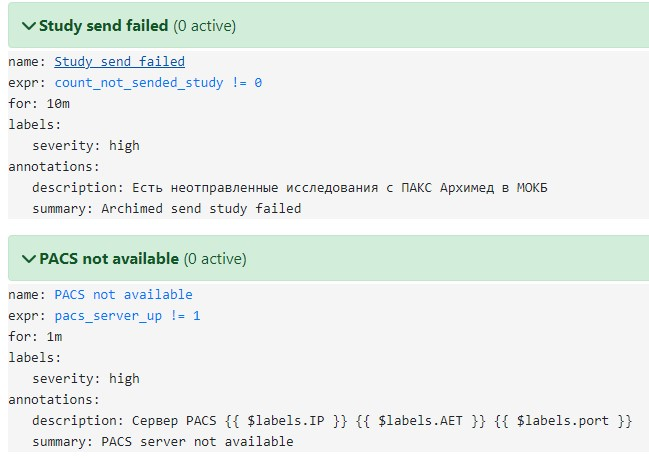

## Описание
Prometheus Exporter для мониторинга состояния отправки исследований с одного PACS-сервера на другой(смотрим исследования за сегодняшний день на сервере-источнике и проверяет наличие исследований на целевом сервере) и для отслеживания доступности PACS-серверов.

Возвращает следующие метрики:

- count_not_sended_study - количество исследований, которые имеются на сервере-источнике, но отсутствуют на сервере назначения
- pacs_server_up - состоние сервера 1 - доступен, - не доступен
- stydy_send_error - выводит метрику gauge с пометками имя пациента (name_patient) и id исселедования (study_id), которое не отправлено. Использовать для этого Gauge возможно, не самая правильная идея, но это работает.


### Вывод метрик
```
# TYPE stydy_send_error gauge
stydy_send_error{name_patient="MAIUROV^IAKOV^DMITRIEVICH",study_id="123337"} 1.0
# HELP count_not_sended_study Number of studies that are not on the target server
# TYPE count_not_sended_study gauge
count_not_sended_study 0.0
# HELP pacs_server_up Server status
# TYPE pacs_server_up gauge
pacs_server_up{AET="51STORAGE",IP="10.0.0.20",port="11112"} 1.0
# HELP pacs_server_up Server status
# TYPE pacs_server_up gauge
pacs_server_up{AET="ARCHIMED",IP="10.100.10.10",port="104"} 1.0
# HELP pacs_server_up Server status
# TYPE pacs_server_up gauge
pacs_server_up{AET="ARCHIMED",IP="10.100.10.10",port="105"} 1.0
# HELP pacs_server_up Server status
# TYPE pacs_server_up gauge
pacs_server_up{AET="ARCHIMED",IP="10.100.10.10",port="106"} 1.0
# HELP pacs_server_up Server status
# TYPE pacs_server_up gauge
pacs_server_up{AET="ARCHIMED",IP="10.100.10.10",port="107"} 1.0
# HELP pacs_server_up Server status
# TYPE pacs_server_up gauge
pacs_server_up{AET="ARCHIMED",IP="10.100.10.10",port="108"} 1.0
# HELP pacs_server_up Server status
# TYPE pacs_server_up gauge
pacs_server_up{AET="ARCHIMED",IP="10.100.10.10",port="109"} 1.0
```

## Требования
Python 3.6.8 (на других версия необходимо тестирование) либо запуск в виде Docker-контейнера


## Запуск

```bash
python.exe f:/tVagrant/dicom/pacs_exporter/pacs_exporter.py --config=f:/tVagrant/dicom/pacs_exporter/config.yml
```

### Docker
[https://hub.docker.com/r/yashamayurov/pacs_exporter](https://hub.docker.com/r/yashamayurov/pacs_exporter)
[DockerFile](./Dockerfile)

```bash
docker run --expose 9000 -p 9000:9000 -v /etc/pacs_exporter:/config yashamayurov/pacs_exporter:v0.0.3
```
### Ansible

```yaml
#### pacs_exporter
  - name: create pacs_exporter congig folder
    become: true
    ansible.builtin.file:
      path: /etc/pacs_exporter/
      state: directory
  - name: copy pacs_exporter config file
    become: true
    ansible.builtin.template:
      src: './templates/pacs_exporter_config.yml.j2'
      dest: /etc/pacs_exporter/config.yml
  - name: run docker image pacs_exporter
    become: true
    community.docker.docker_container:
      name: pacs_exporter
      hostname: pacs_exporter
      image: yashamayurov/pacs_exporter:v0.0.3
      expose:
        - 9000
      ports:
        - "9000:9000"
      volumes:
        - /etc/pacs_exporter:/config
```
## Правила для Prometheus 
```yaml
  - alert: "Study send failed"
    expr: "count_not_sended_study!=0"
    for: "10m"
    labels:
      severity: "high"
    annotations:
      summary: "Archimed send study failed"
      description: "Есть неотправленные исследования с ПАКС"
  - alert: "PACS not available"
    expr: "pacs_server_up!=1"
    for: "1m"
    labels:
      severity: "high"
    annotations:
      summary: "PACS server not available"
      description: "Не доустпен сервер PACS {{ $labels.IP }} {{ $labels.AET }} {{ $labels.port }}"
  - alert: "Patient Study send failed"
    expr: "stydy_send_error!=0"
    for: "4m"
    labels:
      severity: "high"
    annotations:
      summary: "Archimed send study failed"
      description: "Неотправленные исследования с ПАКС Архимед в МОКБ: ФИО {{ $labels.name_patient }} StudyID: {{ $labels.study_id }}"
  
```


## Планы на будущее
1. Дописать комментарии к коду
1. Добавить обработку ошибок (в настоящий момент вылетает при недоступности пакса-источника или пакса-назаняения)
1. ~~Вывести список неотправленных исследований~~ Реализовано
1. Исправить орфорграфические ошибки
1. Создать маршрут и шаблон для Alertmanager

## Источники
* [https://github.com/prometheus/client_python](https://github.com/prometheus/client_python)

* [https://www.gspann.com/resources/blogs/developing-custom-exporter-for-prometheus-using-python/](https://www.gspann.com/resources/blogs/developing-custom-exporter-for-prometheus-using-python/)